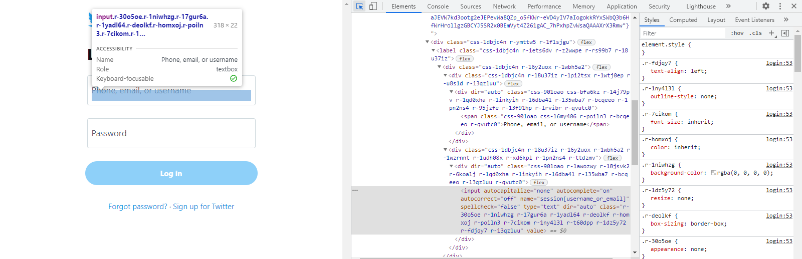
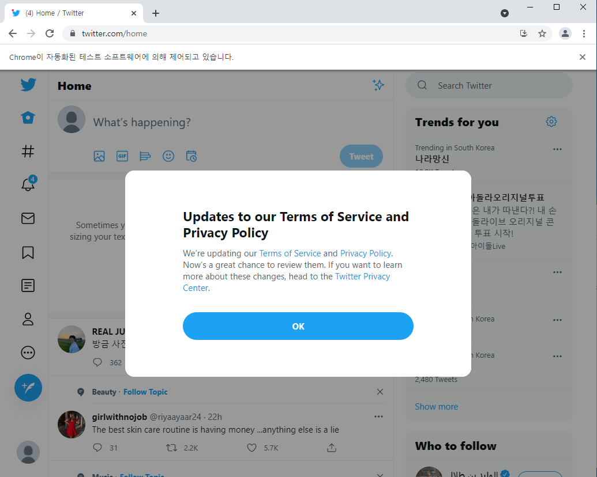
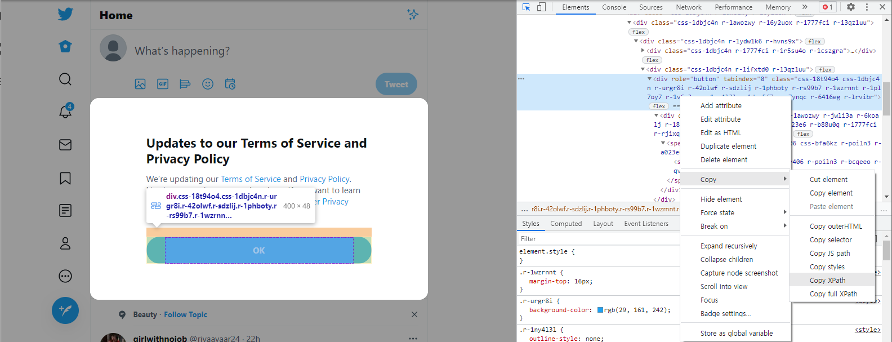
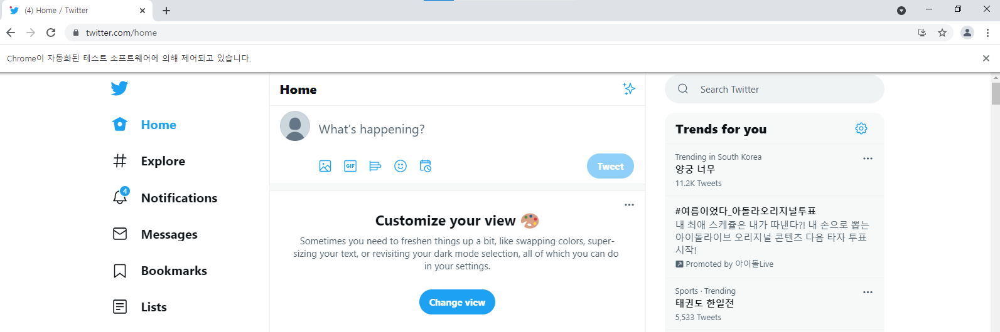
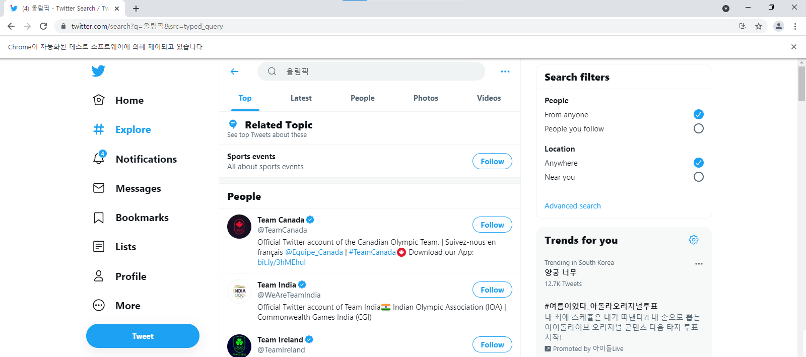

# Twitter crawling
- 오늘은 Twitter API없이 Twitter를 crawling하여 로그인하고, 검색결과 페이지의 내용을 가져오는 작업까지 해보겠습니다.
- [Twitter개발자 사이트](https://developer.twitter.com/en)에서 개발자 신청을 하면 편리하게 타임라인을 가져올 수 있지만 API 요청 한도 제한과 crawling 제한 등의 제약이 있어 Twitter API없이 selenium을 이용한 크롤링을 해보고자 합니다.


## 1. selenium 설치

- selenium 패키지를 다운받아줍니다.
```pip install selenium```


## 2. chrome driver 취득

- 브라우저를 제어해야 하므로 chrome의 driver의 위치를 지정하여 webdriver의 객체를 생성합니다. chrome설치가 안되어있을 경우 [chrome 다운로드 바로가기](https://www.google.com/chrome/?brand=BNSD&gclid=Cj0KCQjw9O6HBhCrARIsADx5qCQU0B82CukG5PC4xjtywaRogdKcjCBK02Um4gh_8EkpKijGVwHcAXkaAgOlEALw_wcB&gclsrc=aw.ds)를 클릭하여 chrome을 설치하고 와야합니다.

- chrome의 driver의 위치

```
    📁 jupyter notebook
    ├───📁 data
    |   ├── 📑 chromedriver.exe
    ├───📁 Twitter          
    |   ├── 📑 twitter_crawling.ipynb  #  현재 디렉토리 위치
```


```python
from selenium import webdriver
from selenium.webdriver.common.by import By
from selenium.webdriver.support.ui import WebDriverWait
from selenium.webdriver.support import expected_conditions as EC

# Jupyter notebook
driver = webdriver.Chrome('../data/chromedriver.exe')

# colab
# driver = webdriver.Chrome('chromedriver',options=option)
```


## 3. 로그인

- 트위터의 로그인 페이지에 접속하여 id와 password입력창의 xpath를 취득합니다. input으로 되어있는 부분이 입력값을 설정해주는 input태그입니다.



- 아이디와 비밀번호를 입력받아 send_key로 로그인페이지의 입력창에 각각 넣어줍니다.
- 그리고 login


```python
# 로그인페이지 접속
driver.get('https://twitter.com/login')
userid = input('아이디')
userpw = input('비밀번호')

# 아이디와 패스워드입력창
driver.find_element_by_xpath('//*[@id="react-root"]/div/div/div[2]/main/div/div/div[2]/form/div/div[1]/label/div/div[2]/div/input').send_keys(userid)
driver.find_element_by_xpath('//*[@id="react-root"]/div/div/div[2]/main/div/div/div[2]/form/div/div[2]/label/div/div[2]/div/input').send_keys(userpw)

# 로그인버튼 누르기
driver.find_element_by_xpath('//*[@id="react-root"]/div/div/div[2]/main/div/div/div[2]/form/div/div[3]/div').click()
```

아이디와 비밀번호를 입력하자 로그인에 성공하여 타임라인페이지로 이동했습니다! 


그런데 policy에 대한 팝업으로 인해 바로 다른 입력이나 버튼을 누를 수 없는 상태이므로 팝업화면이 나타날 경우 OK 버튼을 누르도록 만들겠습니다.
이때 주의할 점은 ```find_element_by_xpath```를 사용하면 만약 policy화면이 없을 경우 NoSuchElementException이 발생하게 됩니다.
이에 대해 **1.**  ```find_elements_by_xpath``` 를 사용해서 Exception이 발생하지 않도록 하고 elements가 존재할 경우에만 클릭하도록 해주거나 **2.** try except 구문처리를 해주는 방법이 있습니다.
저는 try except 구문을 사용하여 구현해보겠습니다. policy의 OK버튼이 존재하지 않는다는건 타임라인 페이지가 표시되고 있다는 의미이므로 exception에러를 무시하고 바로 검색처리를 진행하도록 합니다.
<br>
먼저, policy의 OK 버튼의 xpath를 확인하고 클릭하도록 해줍니다.



```python
from selenium.common.exceptions import NoSuchElementException

try:
    # policy팝업의 OK버튼 찾기
    elem = driver.find_element_by_xpath('//*[@id="layers"]/div[2]/div/div/div/div/div/div[2]/div[2]/div/div/div/div/div[2]/div')
    elem.click()
except NoSuchElementException :  #spelling error making this code not work as expected
    pass
```


## 4. 검색

- 다음은 검색인데, URL에 검색키를 넘겨주어 검색하는 방식을 해보았지만 어째서인지 url은 문제가 없지만 url을 실행시키면 검색결과가 없다고 나와 검색입력창에 입력하여 검색하는 방식으로 구현했습니다.
- Twitter는 버튼이 없고 ```Enter``` 키를 눌러야 하므로 selenium에서 제공하는 Keys를 이용하여 return을 해주도록 합니다. 그런데 개발자모드를 볼때 화면크기가 줄어들면서 xpath가 미묘하게 달라져 최대한 개발자모드영역을 줄여서 xpath를 취득했습니다. 어차피 크롤링할때는 화면이 줄어들 일이 없다고 생각되어 화면크기마다 xpath를 취득하도록 하는 작업은 추가하지 않았습니다.



```python
from selenium.webdriver.common.keys import Keys

search = input("검색내용 입력 : ")

# 오른쪽 사이드 검색입력
search_input_elem = driver.find_element_by_xpath('//*[@id="react-root"]/div/div/div[2]/main/div/div/div/div[2]/div/div[2]/div/div/div/div[1]/div/div/div/form/div[1]/div/label/div[2]/div/input')

# 중앙 검색입력
# search_input_elem = driver.find_element_by_xpath('//*[@id="react-root"]/div/div/div[2]/main/div/div/div/div[1]/div/div[1]/div[1]/div/div/div/div/div[2]/div[2]/div/div/div/form/div[1]/div/label/div[2]/div/input')

search_input_elem.send_keys(search)

# 검색결과 return. Enter 효과
search_input_elem.send_keys(Keys.RETURN);
```

    검색내용 입력 :  올림픽


jupyter에서 올림픽이라고 검색 내용을 입력하자 올림픽에 대한 타임라인이 나옵니다!


이제 page_source를 이용하여 검색 결과 페이지에 대한 소스를 모두 가져옵니다.


```python
# 페이지 내용 모두 가져오기
print(driver.page_source)
```

```
<html dir="ltr" lang="en" style="overflow-y: scroll; overscroll-behavior-y: none; font-size: 15px;"><head><style>
         .DraftEditor-editorContainer, .DraftEditor-root, .public-DraftEditor-content {
            height: inherit;
            max-height: inherit;
            min-height: inherit;
            overflow: auto;
            text-align: initial;
        }

        .public-DraftEditor-content[contenteditable=true] {
            -webkit-user-modify: read-write-plaintext-only
        }

        .DraftEditor-root {
            width: 100%;
            position: relative;
            -webkit-user-select: none;
        }

        .DraftEditor-editorContainer {
            background-color: rgba(255, 255, 255, 0);
            ....
```

다음엔 포스팅에서는 화면스크롤을 하며 아래의 내용을 추출하는 작업을 해보겠습니다!
- 업로드 유저 아이디 (username)
- 트윗 링크 (permalink)
- 트윗 내용 (text)
- 업로드 시간 (date)
- 리트윗 수 (retweets)
- 관심글 수 (favorites)
